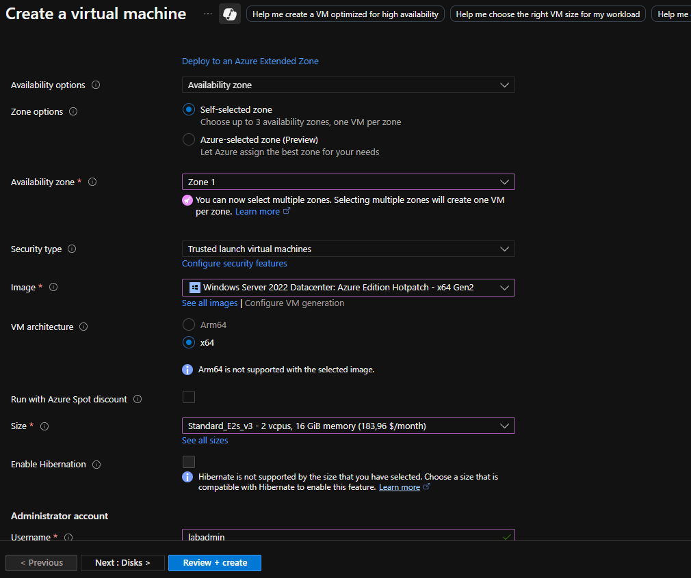
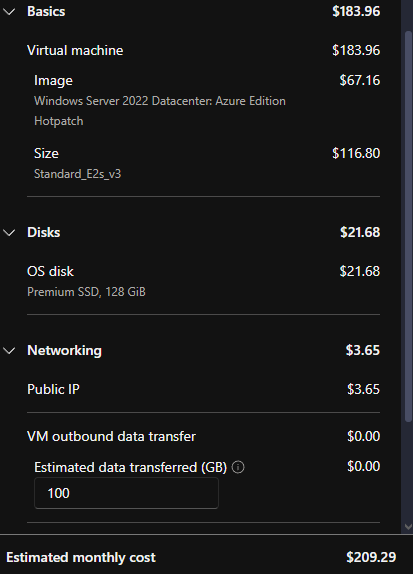
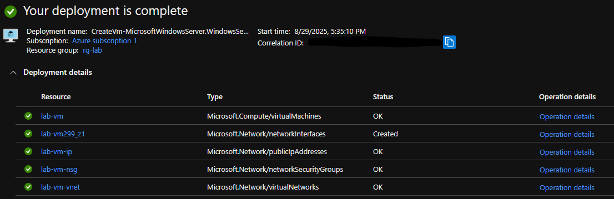
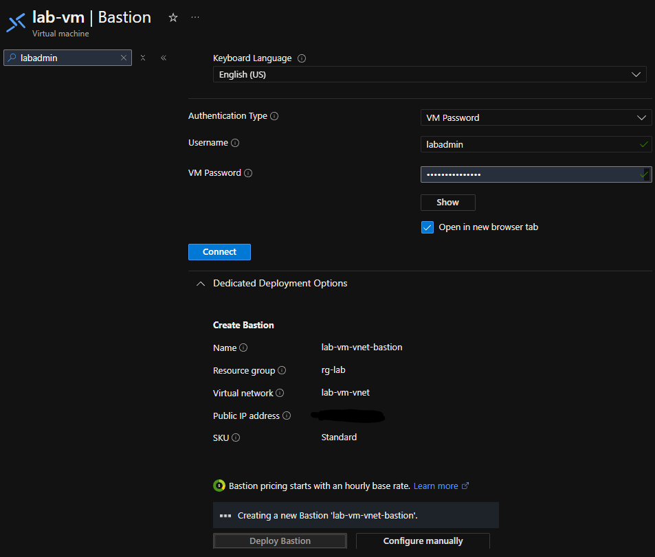
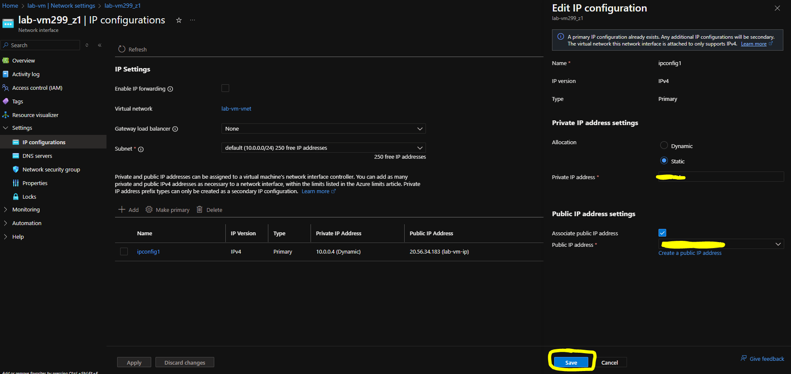
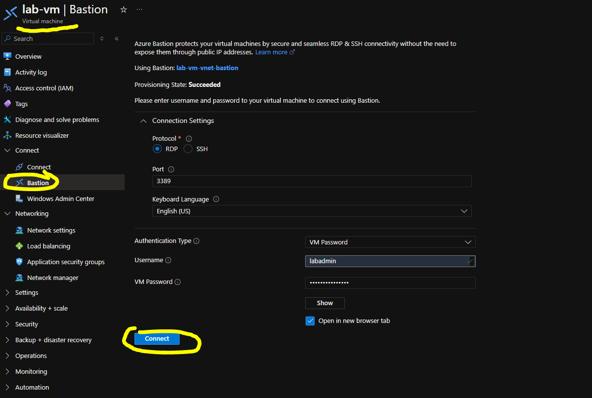
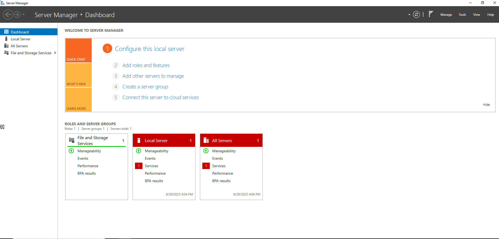
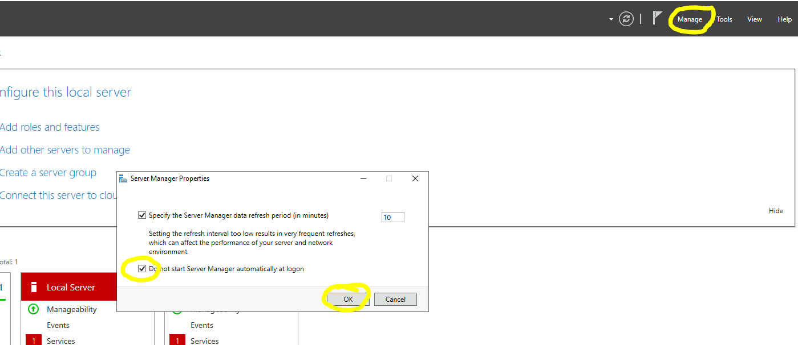

# System Engineer Homelab

## Project: Set up Windows Server VM in Azure

This documentation explains step by step how to deploy and configure a Windows Server virtual machine in Microsoft Azure.

---

## Steps
1. Create a resource group.
2. Deploy a Windows Server virtual machine.
3. Configure networking and access.
4. installing roles and feautures
5. Test the connection.

---

## Screenshots
### Step 1: Create and configure a VM

During the creation process, additional configuration options such as availability zone, security type, and image selection were set.

  

### Step 2: Deploy the VM

Deploying bastion:

### Step 3: Configure networking and access

Setting static Ip: 

connect via baston:

Turning off service manager: 

### Step 4: installing roles and feautures

